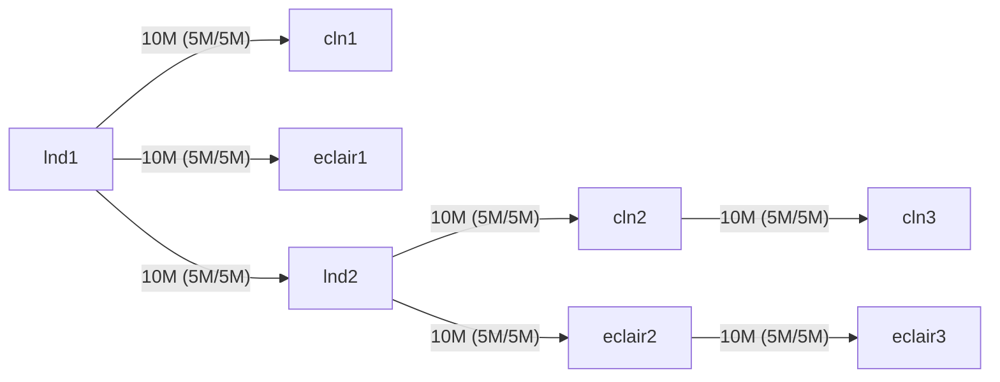

# Bolt 12 Playground

This Bolt 12 Playground provides a docker stack that comprises of bitcoind, [LND](https://github.com/lightningnetwork/lnd), [CLN](https://github.com/ElementsProject/lightning), [Eclair](https://github.com/ACINQ/eclair) and [LNDK](https://github.com/lndk-org/lndk). It connects everything together, initializes wallets, and creates channels between the nodes.

You can use this to get familiar with [Bolt 12](https://bolt12.org/).

## Setup

**Start nodes:**

```sh
docker compose up
```

**Initialise the nodes:**

```sh
./scripts/init.sh
```

This script sets up a network of nodes and channels for the Lightning Network. The nodes are instances of different Lightning Network implementations, including LND, c-lightning (CLN), and Eclair.

### Nodes

The script sets up eight nodes:

- `lnd1` and `lnd2`: These are instances of the LND implementation.
- `cln1`, `cln2`, and `cln3`: These are instances of the c-lightning implementation.
- `eclair1`, `eclair2` and `eclair3`: These are instances of the Eclair implementation.

Each node is funded with Bitcoin through a series of transactions.

### Channels

The script sets up the following channels, which allows for testing of Bolt 12 interoperability between different Lightning Network node implementations and various channel configurations:



## Visualizing the Network with LN-Visualizer

LN-Visualizer is a tool that allows you to visualize the Lightning Network nodes and channels. It can be accessed at [http://localhost:5646/](http://localhost:5646/).

## Using CLI Commands

You can interact with any of the nodes using CLI commands. The bin scripts provided in the repository allow you to issue commands against any of the nodes. 

To use the CLI commands, you need to pass the node name as the first argument to the relevant bin script. The node names are `lnd1`, `lnd2`, `cln1`, `cln2`, `cln3`, `eclair1`, `eclair2`, and `eclair3`.

Here's an example of how to use the CLI commands:

```sh
./bin/lnd.sh lnd1 getinfo
```

In this example, `./bin/lncli` is the bin script for the LND nodes, `lnd1` is the name of the node you're issuing the command against, and `getinfo` is the command you're issuing. This command retrieves information about the `lnd1` node.

You can replace `getinfo` with any other command supported by the node. For a list of available commands, you can use the `help` command. For example:

```sh
./bin/eclair-cli eclair2 help
```

This command displays a list of all commands that you can issue against the `eclair2` node.

## Examples


### Paying to an Eclair node that is one hop away

**Generate a bolt 12 offer on eclair1:**

```sh
./bin/eclair-cli eclair1 tipjarshowoffer
```

**Pay to bolt 12 offer from lndk1:**

```sh
./bin/lndk-cli lndk1 pay-offer [BOLT12_OFFER] 10000
```


### Paying to an Eclair node that is two hops away

**Generate a bolt 12 offer on eclair2:**

```sh
./bin/eclair-cli eclair2 tipjarshowoffer
```

**Pay to bolt 12 offer:**

```sh
./bin/lndk-cli lndk1 pay-offer [BOLT12_OFFER] 10000
```


### Paying to a CLN node

*NOTE: This is not working at the moment.*

**Generate a bolt 12 offer:**

```sh
./bin/lightning-cli cln1 offer 1000 "test offer from cln1"
```

**Pay to bolt 12 offer:**

```sh
./bin/lndk-cli lndk1 pay-offer [BOLT12_OFFER]
```

## Running Tests

This project uses Bats (Bash Automated Testing System) for testing. To run the tests, you first need to install Bats. You can find installation instructions in the [Bats documentation](https://bats-core.readthedocs.io/).

Once you have Bats installed, you can run the tests with the following command:

```sh
bats test/
```

This will run all test files in the `tests/` directory.

Each test is a separate function in the Bats file, and Bats will report a success or failure for each test. If a test fails, Bats will also display the output from the test, which can help you diagnose the problem.


## Clean up

This will remove all docker container, images, and volumes created by this project.

**Clean everything:**
```sh
./scripts/clean.sh
```

